# helMiO

> **Helmio — Take control of your processes.**
> Çoklu sunucu **Supervisor (supervisord)** yönetim ve izleme platformu.

[English](README.md) · **Türkçe**

Helmio; bir ya da onlarca Linux sunucusunda çalışan tüm `supervisord` ana süreçlerini ve alt işlemlerini (process / process group) **tek bir panelden** izlemenizi ve yönetmenizi sağlar. Durum takibi, start/stop/restart, canlı log akışı, konfigürasyon düzenleme, sağlık kontrolü (health check), alarm/bildirim kanalları, filo (fleet) bazlı toplu orkestrasyon, rol bazlı yetkilendirme (RBAC) ve denetim günlüğü (audit log) tek çatı altında toplanmıştır.

---

## İçindekiler

- [Öne çıkan özellikler](#öne-çıkan-özellikler)
- [Ekran görüntüleri](#ekran-görüntüleri)
- [Mimari](#mimari)
- [Bağlantı yöntemleri (connector)](#bağlantı-yöntemleri-connector)
- [Ortam bazlı bağlantı rehberi](#ortam-bazlı-bağlantı-rehberi)
- [Hızlı başlangıç](#hızlı-başlangıç)
- [Yapılandırma (ortam değişkenleri)](#yapılandırma-ortam-değişkenleri)
- [Hedef sunucu ön koşulları](#hedef-sunucu-ön-koşulları)
- [Bileşenler](#bileşenler)
  - [Backend](#backend-helmiobackend)
  - [Frontend](#frontend-helmiofrontend)
  - [Helmio Agent](#helmio-agent-helmioagent)
  - [Event Listener](#event-listener-eventlistener)
- [Güvenlik ve yetkilendirme](#güvenlik-ve-yetkilendirme)
- [REST API & API token (CI/CD)](#rest-api--api-token-cicd)
- [Gerçek zamanlı katman (Socket.IO)](#gerçek-zamanlı-katman-socketio)
- [Health check & otomatik restart](#health-check--otomatik-restart)
- [Alarm & bildirim kanalları](#alarm--bildirim-kanalları)
- [Filo orkestrasyonu (Fleet)](#filo-orkestrasyonu-fleet)
- [Veri deposu](#veri-deposu)
- [Test](#test)
- [Lisans](#lisans)

---

## Öne çıkan özellikler

| Alan | Açıklama |
| --- | --- |
| **Çoklu sunucu** | Sınırsız sunucu kaydı, her biri için farklı bağlantı yöntemi. Connector mimarisi ile her sunucuya en uygun yolla bağlanılır. |
| **5 bağlantı yöntemi** | TCP XML-RPC, yerel Unix socket, SSH tüneli, Docker (exec), Helmio Agent. Hedef sunucuda port açmadan yönetim mümkün. |
| **Gerçek zamanlı durum** | Süreç/grup durum tablosu Socket.IO ile canlı güncellenir; eventlistener push'u + arka plan polling birlikte. |
| **Süreç kontrolü** | start / stop / restart, tekil ve grup, sinyal gönderme (signal), stdin'e veri yazma, log temizleme. |
| **Toplu işlemler** | Bir sunucu içinde toplu sinyal, tüm logları temizle; filo genelinde paralel/sıralı (rolling) toplu start/stop/restart. |
| **Canlı log** | stdout/stderr gerçek zamanlı akış + geriye-scroll (offset tabanlı geçmiş okuma), sunucu taraflı tam log indirme, log içi arama/filtre. |
| **Config yönetimi** | Ham `.conf` editörü + rehberli program oluşturucu (şablonlar, canlı önizleme), `reread` / `update`. |
| **İzleme & trend** | Süreç başına CPU/bellek + host metrikleri zaman serisi, bağımlılıksız SVG trend/donut grafikleri, kalıcı geçmiş. |
| **Health check** | Süreç başına HTTP / TCP / script probe; eşik aşımında otomatik restart veya uyarı. |
| **Alarm & bildirim** | FATAL ve flapping tespiti; Slack / Discord / Telegram / webhook / e-posta kanallarına yönlendirme. |
| **Auth & RBAC** | JWT oturum, bcrypt parola, 3 rol (admin / operator / viewer), denetim günlüğü, login rate-limit. |
| **API token** | CI/CD için rol bazlı `hmo_…` token'ları; `Authorization: Bearer` veya `X-Helmio-Api-Key`. |
| **Güvenlik** | Tüm sırlar (sunucu parolaları, kanal kimlikleri) diskte AES-256-GCM ile şifreli; API yanıtlarında maskelenir. |
| **Kurulum sihirbazı** | Hedef sunucuda supervisord yoksa panelden tespit + kurulum (apt/apk), canlı kurulum logu. |
| **i18n** | Türkçe ve İngilizce arayüz. |

---

## Ekran görüntüleri

<table>
  <tr>
    <td width="50%" valign="top">
      <b>📊 Dashboard</b><br/>
      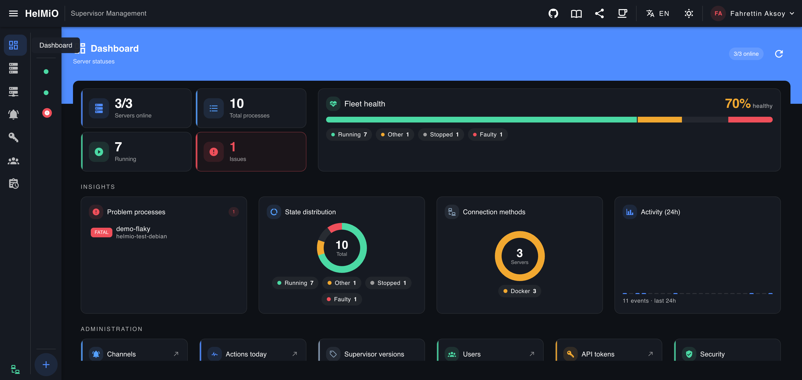<br/>
      <sub>Filo geneli KPI'lar, "fleet health" sağlık çubuğu ve içgörü kartları: sorunlu süreçler, durum dağılımı (donut), bağlantı yöntemleri ve son 24 saatlik aktivite.</sub>
    </td>
    <td width="50%" valign="top">
      <b>🖥️ Sunucular (Servers)</b><br/>
      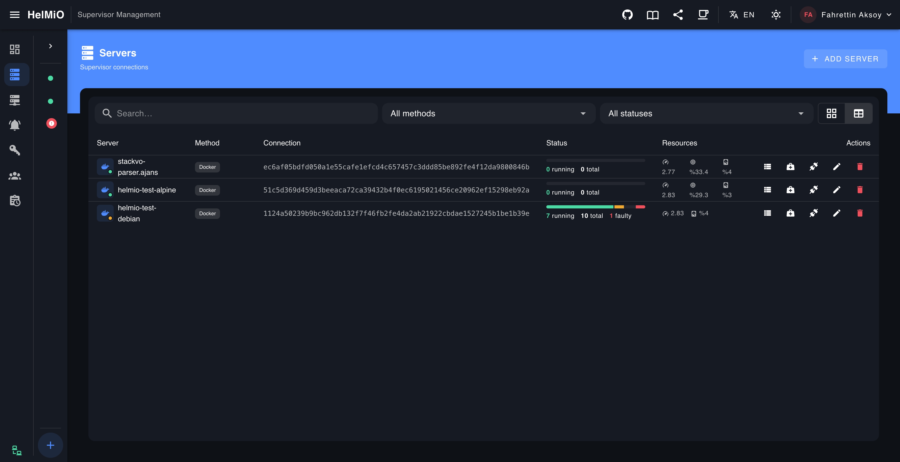<br/>
      <sub>Tüm <code>supervisord</code> bağlantıları kart/tablo görünümünde: yöntem, bağlantı, durum (running/total/faulty) ve canlı CPU/bellek kaynak özetiyle.</sub>
    </td>
  </tr>
  <tr>
    <td width="50%" valign="top">
      <b>📋 Sunucu detayı — süreç tablosu</b><br/>
      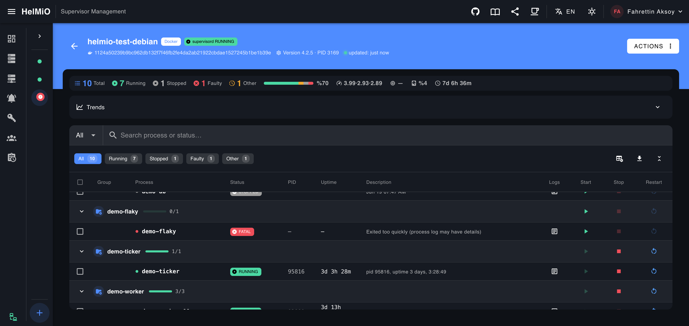<br/>
      <sub>Gruplu süreç listesi (PID, uptime, açıklama), durum filtreleri, trend grafikleri ve satır içi start/stop/restart aksiyonları.</sub>
    </td>
    <td width="50%" valign="top">
      <b>⚙️ Aksiyon menüsü</b><br/>
      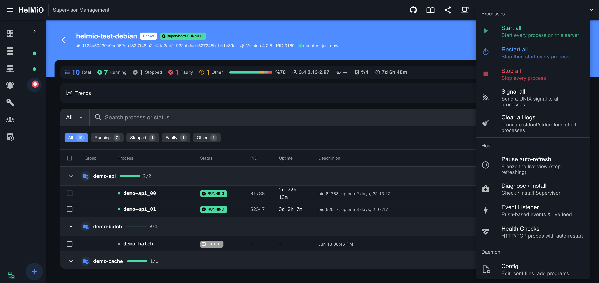<br/>
      <sub>Tüm süreçler için toplu işlemler (start/stop/restart all, signal all, clear all logs) ve sunucu araçları: Diagnose/Install, Event Listener, Health Checks, Config.</sub>
    </td>
  </tr>
  <tr>
    <td width="50%" valign="top">
      <b>🩺 Supervisor kurulum & teşhis</b><br/>
      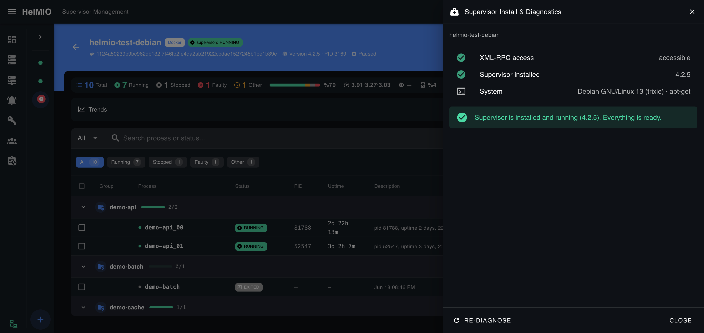<br/>
      <sub>XML-RPC erişimi, supervisord kurulumu ve işletim sistemi (paket yöneticisi) tespiti; gerekirse panelden kurulum.</sub>
    </td>
    <td width="50%" valign="top">
      <b>⚡ Event Listener kurulumu</b><br/>
      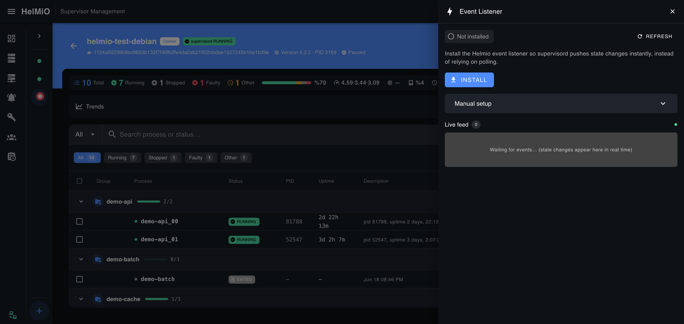<br/>
      <sub>Tek tıkla push tabanlı olay dinleyicisi kurulumu, manuel kurulum talimatı ve canlı olay akışı (live feed).</sub>
    </td>
  </tr>
  <tr>
    <td width="50%" valign="top">
      <b>❤️ Health Check ekleme</b><br/>
      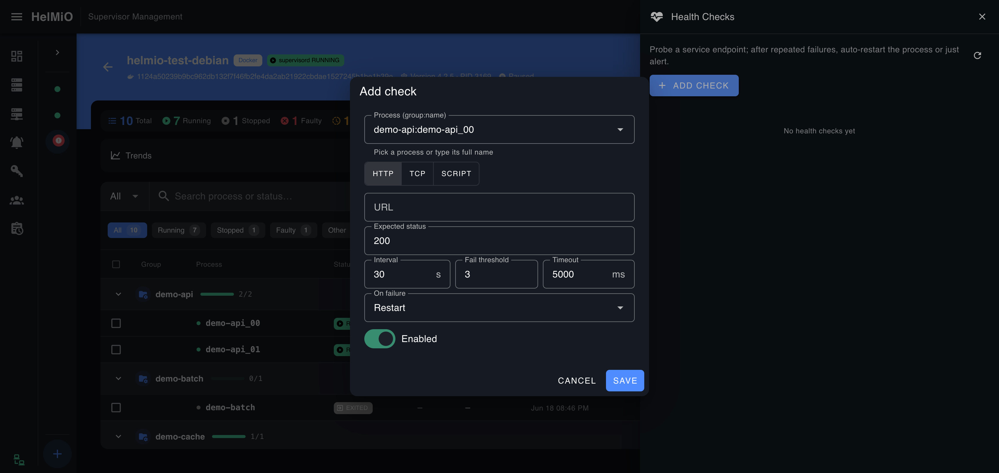<br/>
      <sub>Süreç başına HTTP / TCP / Script probe tanımı: beklenen durum, aralık, hata eşiği, timeout ve başarısızlıkta davranış (restart / yalnızca uyarı).</sub>
    </td>
    <td width="50%" valign="top">
      <b>📝 Config düzenleme</b><br/>
      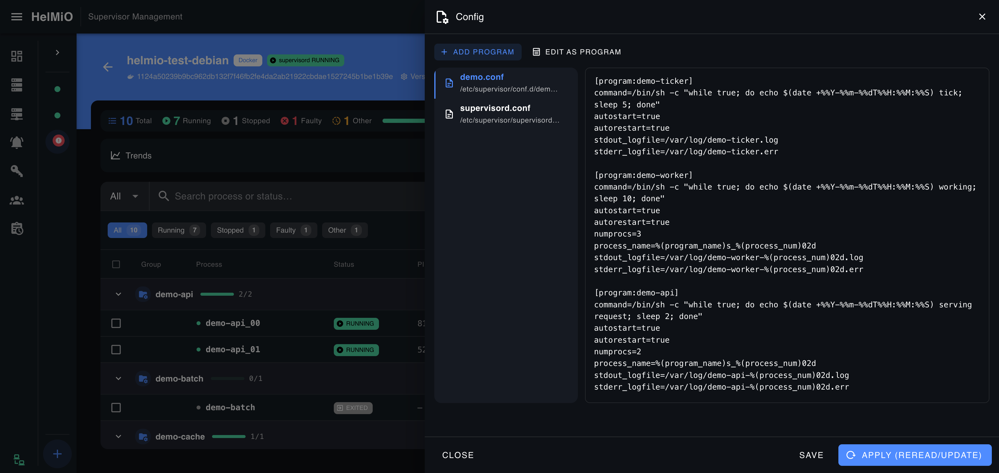<br/>
      <sub>Ham <code>.conf</code> editörü ve rehberli "Add Program" akışı; kaydet + <code>reread</code>/<code>update</code>.</sub>
    </td>
  </tr>
  <tr>
    <td width="50%" valign="top">
      <b>📜 Canlı log akışı</b><br/>
      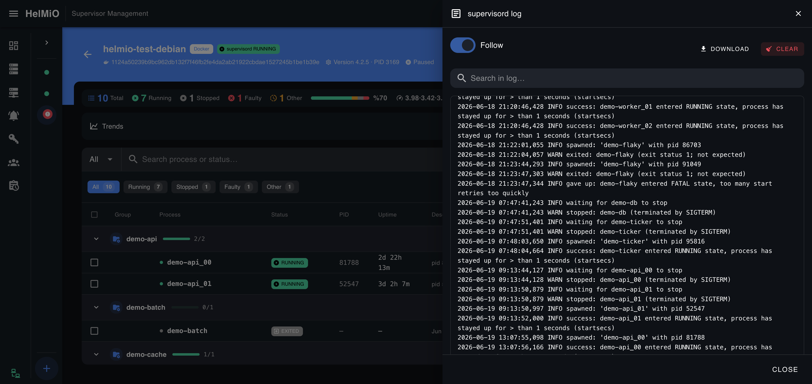<br/>
      <sub><code>supervisord</code> ve süreç logları için canlı takip (follow), log içi arama, indirme ve temizleme.</sub>
    </td>
    <td width="50%" valign="top">
      <b>🚀 Filo operasyonları (Fleet)</b><br/>
      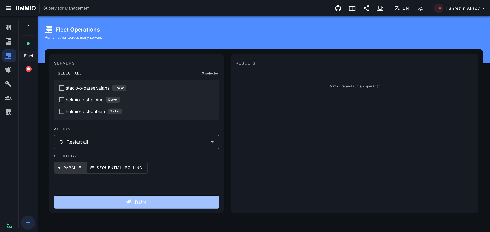<br/>
      <sub>Birden çok sunucuda tek seferde işlem: sunucu seçimi, aksiyon ve <b>paralel</b> ya da <b>sıralı (rolling)</b> strateji, per-sunucu sonuç.</sub>
    </td>
  </tr>
  <tr>
    <td width="50%" valign="top">
      <b>🔔 Bildirim kanalları</b><br/>
      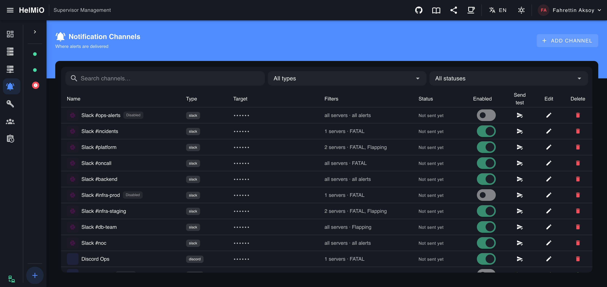<br/>
      <sub>Slack / Discord / Telegram / webhook / e-posta kanalları; sunucu ve alarm türü (FATAL, Flapping) bazlı filtreler, aç/kapa ve test gönderimi.</sub>
    </td>
    <td width="50%" valign="top">
      <b>🔑 API token'ları (CI/CD)</b><br/>
      <br/>
      <sub>Rol bazlı <code>hmo_…</code> token'ları; <code>Authorization: Bearer</code> veya <code>X-Helmio-Api-Key</code> ile programatik erişim, son kullanım takibi.</sub>
    </td>
  </tr>
  <tr>
    <td width="50%" valign="top">
      <b>👥 Kullanıcılar & roller</b><br/>
      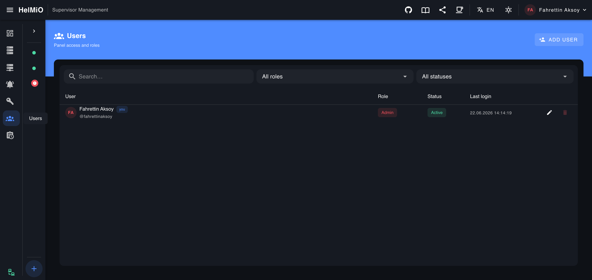<br/>
      <sub>Panel erişimi ve rol atama (admin / operator / viewer), durum ve son giriş bilgisi.</sub>
    </td>
    <td width="50%" valign="top">
      <b>🧾 Denetim günlüğü (Audit Log)</b><br/>
      <br/>
      <sub>Kim, neyi, ne zaman yaptı: aktör/aksiyon/sunucu filtreleri, durum ve IP ile aranabilir denetim kaydı.</sub>
    </td>
  </tr>
</table>

---

## Mimari

Proje bir **npm workspace monorepo**'sudur (`workspaces`: `backend`, `frontend`, `agent`).

```
helmio/
├── backend/         Express + Socket.IO API; supervisord'a connector'larla bağlanır (Node ≥20)
├── frontend/        Vue 3 + Vuetify 3 + Pinia + Vue Router + Socket.IO client (Vite)
├── agent/           Hedef sunucuya kurulan token korumalı XML-RPC proxy ajanı (opsiyonel)
├── eventlistener/   supervisord eventlistener köprüsü — olayları backend'e push eder (Python 3, opsiyonel)
└── test/            Smoke testleri + Docker tabanlı kurulum/test harness'ı
```

### Veri akışı

```
                 ┌──────────────────────────────────────────────┐
   Tarayıcı ──►  │  Frontend (Vite :5173)                        │
   (Vue 3)       │  Axios REST  ·  Socket.IO client              │
                 └───────────────┬──────────────────────────────┘
                                 │  /api  +  /socket.io  (dev'de proxy)
                 ┌───────────────▼──────────────────────────────┐
                 │  Backend (Express + Socket.IO  :3001)         │
                 │  Auth/RBAC · Connectors · Servisler · Stores  │
                 └───┬───────────┬───────────┬──────────┬────────┘
            TCP/RPC  │   SSH     │   Docker   │  HTTP    │  ◄── HTTP POST (ingest)
                     ▼   tünel   ▼   exec     ▼  +token  ▼      (eventlistener push)
                 supervisord  supervisord  supervisord  Helmio Agent ──► supervisord
```

- **Frontend**, geliştirme modunda `/api` ve `/socket.io` isteklerini Vite proxy'si ile `localhost:3001`'e yönlendirir.
- **Backend**, her sunucu için bir **connector** örneği üretir ve önbelleğe alır; XML-RPC çağrılarında `system.multicall` ile çağrıları tek round-trip'te batch'ler.
- **Event Listener** ve **Agent** opsiyoneldir; bağlantı yöntemine göre devreye girer.

---

## Bağlantı yöntemleri (connector)

Backend, `src/connectors/` altında ortak `BaseConnector` üzerine kurulu 5 yöntem sunar. Sunucu eklenirken UI'da yöntem seçilir.

| Yöntem (`id`) | Açıklama | Hedefte port? | Durum |
| --- | --- | --- | --- |
| **TCP XML-RPC** (`tcp`) | supervisord `[inet_http_server]` TCP portuna (ör. `:9001`) doğrudan XML-RPC. **En verimli / önerilen.** | Gerekir | ✅ |
| **Yerel Unix Socket** (`local`) | Aynı makinedeki supervisord socket'ine port açmadan bağlanır. | Hayır | ✅ |
| **SSH tüneli** (`ssh`) | supervisord unix socket'i / localhost TCP portu SSH üzerinden forward edilir. Yalnızca SSH erişimi yeterli. | Hayır | ✅ |
| **Docker (exec)** (`docker`) | Container içindeki supervisord'a `docker exec` ile erişir; container'a hiçbir şey kurulmaz, port açılmaz. Helmio'nun Docker daemon'a erişimi gerekir. | Hayır | ✅ |
| **Helmio Agent** (`agent`) | Hedef sunucuya kurulan ajan ([agent/](agent/)) supervisord'a yerelden bağlanır; panel token'lı HTTP ile erişir. NAT/firewall arkası için ideal. | Agent portu | ✅ |

> **Not:** TCP XML-RPC en düşük gecikmeli ve en az kurulum gerektiren yöntemdir. Hedef sunucuda `supervisord.conf` içinde `[inet_http_server]` bölümünün açık olması yeterlidir. Connector örnekleri sunucu `id`'sine göre önbelleğe alınır ve tanım değişince (`updatedAt`) yeniden kurulur.

---

## Ortam bazlı bağlantı rehberi

| Ortam | Önerilen yöntem | Notlar |
| --- | --- | --- |
| **macOS / Linux (yerel dev)** | Yerel Unix Socket | Homebrew socket'i genelde `/opt/homebrew/var/run/supervisor.sock`. Port açmaya gerek yok. Uzaktaysa SSH/TCP. |
| **Windows + WSL2** | TCP XML-RPC | WSL içinde `inet_http_server`'ı `0.0.0.0:9001`'e bağlayın; WSL2 *localhostForwarding* ile host'tan `localhost:9001`. Alternatif: WSL'de `sshd` + SSH. |
| **Docker container** | Docker (exec) veya TCP | Port açmak istemiyorsanız Docker (exec) — Helmio'nun `/var/run/docker.sock`'a erişimi gerekir. Ya da `-p 9001:9001` publish edip TCP. |
| **Uzak Linux sunucu** | SSH tüneli veya TCP | SSH hiç port açmadan çalışır; TCP için `inet_http_server` `0.0.0.0:9001`. NAT arkası için Agent. |

> Docker (exec) yöntemi, Helmio bir container içinde çalışıyorsa host'un Docker socket'ini mount etmenizi gerektirir: `-v /var/run/docker.sock:/var/run/docker.sock`. Agent yöntemi için bkz. [agent/README.md](agent/README.md).

---

## Hızlı başlangıç

Gereksinim: **Node.js ≥ 20**.

```bash
# 1) Tüm workspace bağımlılıklarını kur
npm install

# 2) Backend (:3001) + frontend (:5173) birlikte (watch modunda)
npm run dev
```

- Backend API: <http://localhost:3001>
- Frontend: <http://localhost:5173>

İlk açılışta panel **kurulum (setup)** ekranıyla karşılar: ilk **admin** kullanıcısını oluşturursunuz. Sonrasında sunucularınızı **Servers → Add Server** ile ekleyebilirsiniz.

### Faydalı script'ler (kök `package.json`)

| Komut | İşlev |
| --- | --- |
| `npm run dev` | Backend + frontend'i birlikte başlatır (concurrently). |
| `npm run dev:backend` | Sadece backend (`node --watch`). |
| `npm run dev:frontend` | Sadece frontend (Vite). |
| `npm run build` | Frontend production build'i (Vite). |
| `npm start` | Backend'i production modunda başlatır. |
| `npm test` | Smoke test paketini çalıştırır (`test/smoke.mjs`). |

---

## Yapılandırma (ortam değişkenleri)

Backend ayarları `backend/.env` ile yapılır (`backend/.env.example` örnek alınabilir):

| Değişken | Varsayılan | Açıklama |
| --- | --- | --- |
| `PORT` | `3001` | Backend HTTP/Socket.IO portu. |
| `CORS_ORIGIN` | `http://localhost:5173` | İzin verilen frontend kaynağı (CORS). |
| `POLL_INTERVAL_MS` | `3000` | Abone olunan sunucu başına gerçek zamanlı poller'ın yenileme aralığı (ms). |
| `DATA_DIR` | `./data` | JSON veri deposunun yolu. |
| `JWT_SECRET` | *(boş)* | Oturum JWT'lerini imzalamak için sır. Boşsa rastgele üretilip `DATA_DIR/.jwt-secret`'a yazılır. **Production'da set edin.** |
| `JWT_TTL` | `12h` | Oturum token ömrü (`12h`, `7d`, `30m`…). |
| `HELMIO_SECRET_KEY` | *(boş)* | Diskteki sırların (sunucu parolaları, kanal kimlikleri) AES-256-GCM anahtarı. Boşsa üretilip `DATA_DIR/.secret-key`'e yazılır. **Production'da set edin ve güvende tutun** — kaybı, saklanan sırları kurtarılamaz yapar. |
| `HELMIO_PUBLIC_URL` | `http://localhost:PORT` | Backend'in hedef sunuculardan erişilebildiği genel URL. Üretilen eventlistener config'ine gömülür ki listener olayları geri POST edebilsin. **Production'da set edin.** |
| `ALERT_POLL_INTERVAL_MS` | `30000` | Arka plan alarm taraması (ms): eventlistener kurulu olmayan, kimsenin izlemediği sunucuları da yoklar ki bildirimler tetiklensin. `0` = devre dışı. |

---

## Hedef sunucu ön koşulları

### TCP XML-RPC için

`/etc/supervisor/supervisord.conf` (veya dağıtımınızın yolu) içine:

```ini
[inet_http_server]
port=*:9001
username=admin
password=secret
```

Ardından:

```bash
supervisorctl reread && supervisorctl update    # veya servisi restart edin
```

### Diğer yöntemler

- **Yerel socket / SSH / Docker:** ek port gerekmez; sırasıyla socket erişimi, SSH erişimi veya Docker daemon erişimi yeterlidir.
- **Agent:** hedef sunucuya [agent/](agent/) kurulur (bkz. [Helmio Agent](#helmio-agent-helmioagent)).
- **supervisord yoksa:** panel, hedefte supervisord'u tespit edip kurabilir (shell erişimi olan yöntemlerde — local/SSH/Docker). Bkz. [SupervisorInstallPanel](#frontend-helmiofrontend).

---

## Bileşenler

### Backend (`@helmio/backend`)

Express 4 + Socket.IO 4 üzerine kurulu API. Giriş noktası [backend/src/index.js](backend/src/index.js).

**Önemli bağımlılıklar:** `express`, `socket.io`, `xmlrpc` (supervisord), `ssh2` (SSH tüneli), `dockerode` (Docker exec), `jsonwebtoken` + `bcryptjs` (auth), `zod` (şema doğrulama), `nodemailer` (e-posta bildirimi), `nanoid`, `dotenv`.

**Mount edilen route'lar** ([index.js](backend/src/index.js)):

| Yol | Kimlik doğrulama | İşlev |
| --- | --- | --- |
| `GET /api/health` | Yok | Sağlık ucu. |
| `/api/ingest` | Per-sunucu token (JWT değil) | Makineden-makineye olay alımı (eventlistener push). |
| `/api/auth` | Public + self | `setup`, `login`, `me`, `change-password`, `logout`. |
| `/api/users` | Admin | Kullanıcı CRUD, rol yönetimi (son admin koruması). |
| `/api/audit` | Admin | Denetim günlüğü sorgulama (filtreli). |
| `/api/channels` | Admin | Bildirim kanalı CRUD + test gönderimi. |
| `/api/apitokens` | Admin | API token CRUD (`hmo_…`). |
| `/api/fleet` | JWT | Çapraz-sunucu toplu orkestrasyon. |
| `/api/overview` | JWT | Dashboard toplamları (metrik + health özeti). |
| `/api/servers` | JWT + RBAC | Sunucu CRUD + bağlantı testi + daemon kontrolü + config + eventlistener. |
| `/api/servers/:id/processes` | JWT + RBAC | start/stop/restart/signal/stdin/clearlog, tekil süreç. |
| `/api/servers/:id/groups` | JWT + RBAC | Grup işlemleri. |
| `/api/servers/:id/bulk` | JWT + RBAC | Toplu işlemler (toplu sinyal, tüm logları temizle). |
| `/api/servers/:id/healthchecks` | JWT + RBAC | Health check CRUD. |

**Servisler** ([backend/src/services/](backend/src/services/)):

- **`supervisorService`** — connector üzerinden snapshot, start/stop/restart, signal, stdin, daemon kontrolü, log tail (offset'li geçmiş), host metrikleri. XML-RPC `system.multicall` ile batch'leme.
- **`notifierService`** — türetilen alarmları kanallara yönlendirir (Slack/Discord/Telegram/webhook/e-posta), tekrar bastırma (dedup) penceresi.
- **`healthCheckService`** — HTTP/TCP/script probe'larını zamanlar; eşik aşımında restart veya uyarı.
- **`installerService`** — hedefte supervisord tespiti ve kurulumu (apt/apk).

**Connector'lar** ([backend/src/connectors/](backend/src/connectors/)): `BaseConnector` + `TcpXmlRpcConnector`, `LocalConnector`, `SshUnixSocketConnector`, `DockerConnector`, `AgentConnector`. Bkz. [Bağlantı yöntemleri](#bağlantı-yöntemleri-connector).

### Frontend (`@helmio/frontend`)

Vue 3.5 + Vuetify 3.7 + Pinia + Vue Router + Vue i18n, Vite 6 ile paketlenir. Grafikler **harici kütüphane olmadan** saf SVG ile çizilir.

**Geliştirme proxy'si** ([frontend/vite.config.js](frontend/vite.config.js)): port `5173`; `/api` ve `/socket.io` → `localhost:3001`.

**Görünümler (views)** ve route'lar ([frontend/src/router/index.js](frontend/src/router/index.js)):

| Route | Görünüm | Erişim | İçerik |
| --- | --- | --- | --- |
| `/login` | LoginView | Public | Giriş / ilk kurulum. |
| `/dashboard` | DashboardView | Oturum | KPI'lar, filo sağlık çubuğu, sorunlu süreçler, en çok tüketenler, trendler, admin özetleri. |
| `/servers` | ServersView | Oturum | Sunucu kart/tablo görünümü, arama, test/teşhis/düzenle. |
| `/servers/:id` | ServerDetailView | Oturum | Süreç tablosu (gruplu), trend grafikleri, daemon kontrolü, config/log panelleri. |
| `/fleet` | FleetView | `process:control` | Çoklu sunucu toplu işlem, canlı ilerleme. |
| `/admin/channels` | ChannelsView | Admin | Bildirim kanalı yönetimi. |
| `/admin/tokens` | ApiTokensView | Admin | API token yönetimi (tek seferlik gösterim). |
| `/admin/users` | UsersView | Admin | Kullanıcı yönetimi + rol atama. |
| `/admin/audit` | AuditView | Admin | Aranabilir denetim günlüğü. |

**Öne çıkan bileşenler** ([frontend/src/components/](frontend/src/components/)): `ProcessTable` (gruplu, filtreli, kolon tercihleri localStorage'da), `LogPanel` (canlı stdout/stderr + scroll-back), `ConfigPanel` + `ProgramBuilder` (INI editörü + rehberli program ekleme), `HealthChecksPanel`, `EventListenerPanel` (tek tık kurulum + token döndürme), `SupervisorInstallPanel` (teşhis + kurulum + canlı log), `TrendChart` / `DonutChart` (SVG), `ServerFormDrawer` (5 yöntemle sunucu ekle + bağlantı testi), `ProcessDetailPanel` (sinyal + stdin), `StatusChip`, `ServerCard`.

**Store'lar (Pinia):** `auth` (token, kullanıcı, setup durumu), `servers` (sunucu listesi + CRUD), `realtime` (Socket.IO snapshot/event/alert), `ui` (sunucu formu durumu).

**API katmanı:** [src/api/client.js](frontend/src/api/client.js) (Axios, `/api` tabanı, Bearer token otomatik ekleme, 401 yakalama), [src/api/socket.js](frontend/src/api/socket.js) (Socket.IO).

**i18n:** Türkçe (`tr`) ve İngilizce (`en`); seçim `localStorage` (`helmio-lang`) → tarayıcı dili → İngilizce sırasıyla belirlenir.

### Helmio Agent (`@helmio/agent`)

Hedef sunucuya supervisord'un **yanına** kurulan, token korumalı hafif HTTP/JSON proxy. Panel'in çağrılarını yerel supervisord'a XML-RPC ile iletir. NAT/firewall arkasındaki sunucuları, supervisord TCP portunu açmadan yönetmeyi sağlar. Giriş noktası [agent/src/index.js](agent/src/index.js).

**Uçlar:**
- `GET /health` — kimlik doğrulamasız; supervisord versiyonunu döner (`{ ok, version, name: 'helmio-agent' }`), erişilemezse 502.
- `POST /rpc` — `Authorization: Bearer <token>` zorunlu; gövde `{ method, params }`. Yalnızca `supervisor.*` ve `system.*` metotlarına izin verilir (whitelist).

**Ortam değişkenleri:** `AGENT_PORT` (8787), `AGENT_HOST` (0.0.0.0), `AGENT_TOKEN` (**zorunlu**; `change-me`/boş ise başlamaz), `SUPERVISOR_SOCKET` veya `SUPERVISOR_HOST`+`SUPERVISOR_PORT` (9001), `SUPERVISOR_PATH` (/RPC2), `SUPERVISOR_USER`/`SUPERVISOR_PASS`. Token üretimi: `node -e "console.log(require('crypto').randomBytes(24).toString('hex'))"`. Ayrıntı: [agent/README.md](agent/README.md).

### Event Listener (`eventlistener/`)

supervisord'un `[eventlistener:]` protokolünü stdin/stdout üzerinden konuşan, **bağımlılıksız** bir Python 3 betiği ([eventlistener/helmio_eventlistener.py](eventlistener/helmio_eventlistener.py)). Durum değişimi olaylarını anlık olarak backend'e HTTP POST eder; panelde polling yerine **canlı** güncelleme sağlar.

- **Dinlenen olaylar:** `PROCESS_STATE`, `PROCESS_GROUP`, `SUPERVISOR_STATE_CHANGE`, `TICK_60`.
- **Push hedefi:** `POST {HELMIO_INGEST_URL}/{HELMIO_SERVER_ID}/events`, `Authorization: Bearer {HELMIO_TOKEN}`.
- **Ortam değişkenleri:** `HELMIO_INGEST_URL`, `HELMIO_SERVER_ID`, `HELMIO_TOKEN` (opsiyonel), `HELMIO_TIMEOUT` (5 sn).
- HTTP push başarısız olsa bile supervisord'a daima `RESULT 2\nOK` döner; listener çökmesi süreçleri etkilemez.

Panelden tek tıkla kurulabilir: **Sunucu Detayı → ⋮ → Event Listener → Install** (shell erişimi olan yöntemlerde). Ayrıntı: [eventlistener/README.md](eventlistener/README.md).

---

## Güvenlik ve yetkilendirme

- **Kimlik doğrulama:** JWT tabanlı oturum; parolalar `bcrypt` (10 tur) ile hash'lenir.
- **RBAC — 3 rol:**
  - **viewer** — salt-okuma.
  - **operator** — süreç kontrolü (start/stop/restart/signal) + `daemon:reload`.
  - **admin** — her şey (kullanıcı/kanal/token yönetimi, daemon restart, config yazma…).
- **İzinler:** `server:read`, `process:control`, `daemon:reload`, `daemon:restart`, `server:manage`, `config:write`, `user:manage`, `audit:read`, `notify:manage`.
- **Sırların şifrelenmesi:** sunucu parolaları, SSH anahtarları, kanal kimlikleri diskte **AES-256-GCM** ile şifrelenir (`enc:1:` öneki) ve API yanıtlarında maskelenir (`••••••`).
- **Login rate-limit:** IP+kullanıcı başına 15 dakikada 5 başarısız denemeden sonra `429`.
- **Denetim günlüğü:** kritik işlemler `data/audit.log` içine JSONL olarak yazılır (azami ~20k satır).

---

## REST API & API token (CI/CD)

İnsan olmayan istemciler (CI/CD, otomasyon) için rol bazlı API token'ları üretilir.

- Token formatı `hmo_…`; diskte yalnızca **SHA-256 hash'i** saklanır, düz değer tek seferlik gösterilir.
- Kimlik doğrulama: `Authorization: Bearer hmo_…` **veya** `X-Helmio-Api-Key: hmo_…`.
- Token'a atanan rol, kullanıcı rolleriyle aynı RBAC kurallarına tabidir.

```bash
# Örnek: bir süreci API token ile yeniden başlat
curl -X POST https://panel.example.com/api/servers/<serverId>/processes/<name>/restart \
     -H "Authorization: Bearer hmo_xxx"
```

---

## Gerçek zamanlı katman (Socket.IO)

Backend [src/realtime.js](backend/src/realtime.js) ile oda (room) tabanlı bir Socket.IO katmanı sunar:

- **`subscribe` / `unsubscribe`** — sunucu odasına abone olunca o sunucu `POLL_INTERVAL_MS` (varsayılan 3 sn) ile yoklanır.
- **`snapshot`** — süreç durum anlık görüntüsü.
- **`event`** — eventlistener'dan gelen durum değişimi olayları.
- **`alert`** — türetilen FATAL / flapping / health-check alarmları.
- **`log:start` / `log:chunk` / `log:stop`** — canlı log akışı.
- **`install:start` / `install:log` / `install:result`** — supervisord kurulum canlı akışı.
- **`fleet`** — çapraz-sunucu orkestrasyon ilerlemesi.

**Alarm tespiti:** FATAL (state=200), flapping (60 sn'de 3+ durum değişimi) ve health-check hataları otomatik türetilir. Arka plan taraması (`ALERT_POLL_INTERVAL_MS`) kimsenin izlemediği sunucularda da bildirim tetikler.

---

## Health check & otomatik restart

Süreç başına **HTTP / TCP / script** probe tanımlanır:

- Eşik (ardışık hata sayısı) aşıldığında **otomatik restart** veya yalnızca **uyarı** (bildirim kanallarına bağlı).
- Health-check başarısızlıkları alarm akışına dahil edilir.
- Yönetim: panelden [HealthChecksPanel](#frontend-helmiofrontend) veya `/api/servers/:id/healthchecks`.

---

## Alarm & bildirim kanalları

Desteklenen kanal türleri: **Slack**, **Discord**, **Telegram**, **webhook**, **e-posta** (`nodemailer`).

- FATAL ve flapping olaylarında ve health-check eşik aşımında tetiklenir.
- Kanal kimlikleri (token, webhook URL, SMTP parolası) diskte şifreli; yanıtlarda maskeli.
- Panelden **test gönderimi** yapılabilir.

---

## Filo orkestrasyonu (Fleet)

Birden çok sunucuda aynı işlemi tek seferde uygulamak için:

- **Paralel** ya da **sıralı (rolling)** strateji.
- Her sunucu için ayrı sonuç; canlı ilerleme Socket.IO `fleet` olayıyla yayınlanır.
- Erişim `process:control` izniyle korunur.

---

## Veri deposu

Harici veritabanı yoktur; tüm durum `DATA_DIR` (varsayılan `backend/data/`) altında JSON/JSONL dosyalarında tutulur:

| Dosya | İçerik |
| --- | --- |
| `servers.json` | Sunucu tanımları (sırlar şifreli). |
| `users.json` | Kullanıcılar (bcrypt parola hash'leri). |
| `channels.json` | Bildirim kanalları (kimlikler şifreli). |
| `api-tokens.json` | API token hash'leri + meta. |
| `audit.log` | Denetim günlüğü (JSONL, append-only). |
| `metrics.json` | Zaman serisi metrik örnekleri (sunucu başına ~2000, periyodik kalıcı). |
| `.jwt-secret` | Otomatik üretilen JWT imza anahtarı (yoksa). |
| `.secret-key` | Otomatik üretilen AES anahtarı (yoksa). |

> `.jwt-secret` ve `.secret-key` kaybolursa oturumlar geçersiz olur ve saklanan sırlar **kurtarılamaz**. Production'da `JWT_SECRET` ve `HELMIO_SECRET_KEY`'i açıkça set edin ve yedekleyin.

---

## Test

```bash
npm test                                  # smoke test paketi (test/smoke.mjs)
```

**Smoke testleri** ([test/smoke.mjs](test/smoke.mjs)) backend'i **süreç içinde** (geçici `DATA_DIR` ile) ayağa kaldırır ve şunları doğrular: auth & RBAC (setup, login rate-limit, rol kısıtları), at-rest şifreleme (`enc:1:` öneki, maskeleme), API token'ları, bildirim kanalları (maskeleme + test gönderimi), olay alımı + alarm yönlendirme, program config oluşturucu/önizleme, health check, fleet doğrulama, metrik ucu.

**Docker tabanlı kurulum testi** ([test/run.mjs](test/run.mjs) + [test/docker-compose.yml](test/docker-compose.yml)) supervisord kurulu olmayan temiz container'lara (Debian/Alpine) karşı tespit → kurulum → yeniden tespit akışını çalıştırır:

```bash
docker compose -f test/docker-compose.yml up -d     # test container'larını başlat
node test/run.mjs [container-adı]                    # varsayılan: helmio-test-debian
test/seed-demo.sh [container-adı]                    # zengin demo supervisord config'i yükle
```

Ayrıntı: [test/README.md](test/README.md).

---

## Lisans

Bu proje **MIT Lisansı** ile lisanslanmıştır. Yazılımı kullanma, kopyalama, değiştirme, birleştirme, yayımlama, dağıtma, alt lisanslama ve/veya satma hakları; yukarıdaki telif hakkı bildirimi ve izin bildiriminin tüm kopyalarda yer alması koşuluyla serbesttir. Yazılım "olduğu gibi" sunulur; herhangi bir garanti verilmez.

Tam metin için bkz. [LICENSE](LICENSE).
